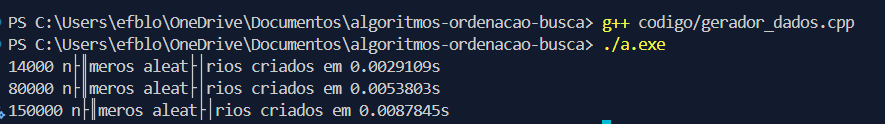
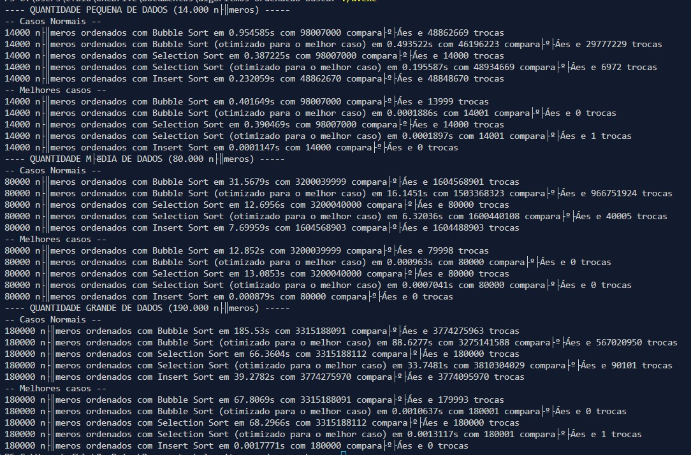
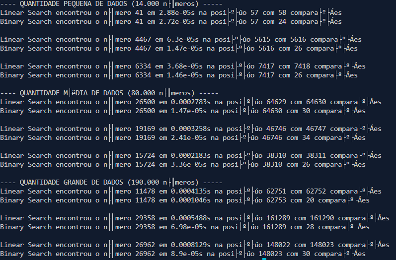

# Trabalho Prático - Algoritmos de Ordenação e Busca
## 1. Geração de dados:
- Os dados serão criados em arquivos binários que serão posteriormente consumidos pelos algoritmos de ordenação dentro de [codigo/ordenacao.cpp](codigo/ordenacao.cpp);
-  **Geração:**
    - Primeiro, garanta que você tem um compilador de c/c++ instalado;
    - Se tiver, é só seguir os seguintes passos:
        - **Linux**:
        ```shell
            >> g++ codigo/gerador_dados.cpp && ./a.out
        ```
        - **Windows**:
        ```shell
            >> g++ codigo/gerador_dados.cpp
            >> ./a.exe
        ```
- **Resultado:**
    - O resultado dessa execução deve ser a quantidade de números criados por arquivo em certo número de segundos:
    

    (No Linux o display das letras com acento devem funcionar normalmente)
    - Assim como os arquivos .bin localizados no diretório "dados":

    

## 2. Ordenação de dados:
- Nesse passo e feita a ordenação dos arquivos previamente gerados, utilizando 5 algoritmos diferentes e cronometrando o tempo de execução e o número de comparações e trocas de posição dentro do vetor;
-  **Execução:**
    - Para executar os códigos basta rodar os seguintes comandos:
        - **Linux**:
            ```shell
                >> g++ codigo/ordenacao.cpp && ./a.out
            ```
            - **Windows**:
            ```shell
                >> g++ codigo/ordenacao.cpp
                >> ./a.exe
            ```
- **Resultado:**
    - O resultado dessa execução deve ser a quantidade de números ordenados, o método de ordenação utilizado, o tempo decorrido (em segundos), o número de comparações e o número de trocas de posição:
    
    

    - Os arquivos .bin com a ordenação crescente dos arquivos gerados anteriormente também estarão localizados no diretório "dados":

    

## 3. Busca de dados:
- Aqui são utilizados os algoritmos de busca Linear e Binário para encontrar um número que é gerado aleatoriamente com base no tamanho do vetor, utilizando dos arquivos gerados com a ordenação feita pelo passo anterior, exibindo o método utilzado, tempo até encontrar o número desejado e o número de comparações feitas;
- Cada um roda 3 vezes, cada uma com um número diferente, para facilitar a extração das médias e conseguir dados mais precisos; 
-  **Execução:**
    - Para executar os códigos basta rodar os seguintes comandos:
        - **Linux**:
            ```shell
                >> g++ codigo/busca.cpp && ./a.out
            ```
            - **Windows**:
            ```shell
                >> g++ codigo/busca.cpp
                >> ./a.exe
            ```
- **Resultado:**

	